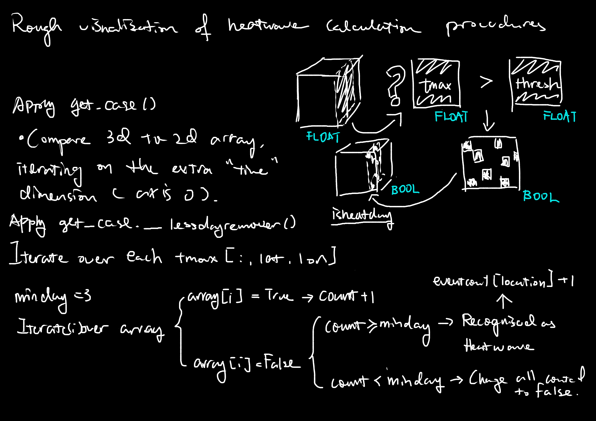
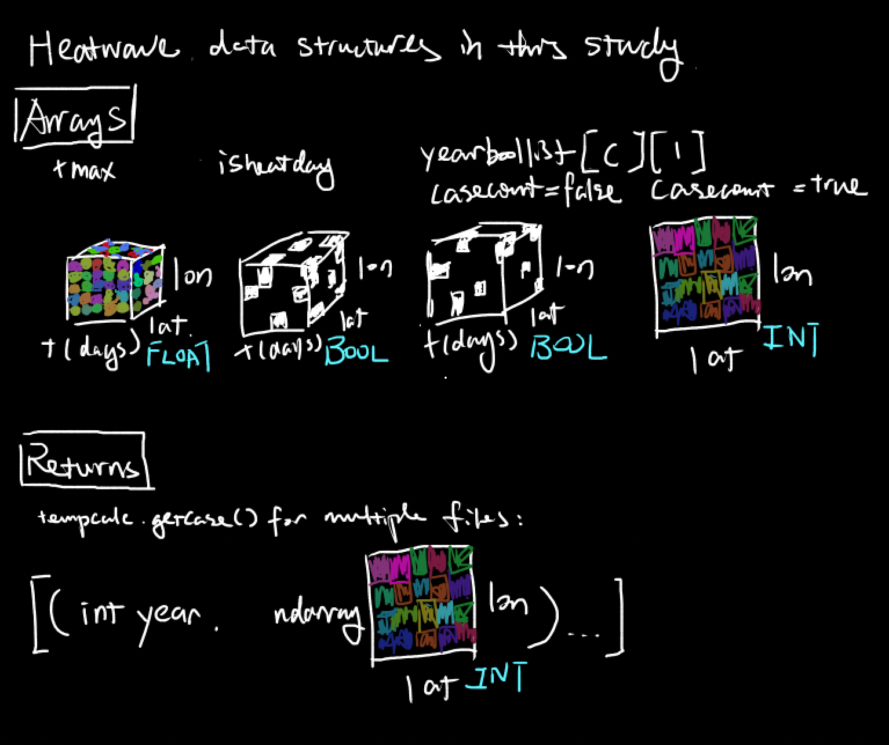

Regeneron ISEF Sichuan Science Fair 2023, Project EAEV 011: PROJECT NOTES

# **Quantifying Heatwaves' Impact on Global Biodiversity Loss**

> “Climate is what we expect, weather is what we get.” – **Mark Twain**

Author: **Michael Mu** - BASIS International School Nanjing

Instructed by: **Azam Chattha, Ph.D.**, - BASIS International School Nanjing (*referred in this note as Dr. C*)

# -September: Initial Research

As far as the study is concerned, first finding more about **Global Warming** (*climate change* in general), **Heatwave** and **Biodiversity** is necessary.

## Global Warming

Global warming is divided into two periods.

- **Historical**: Rise of temperature over the last millions of years (Glacial)
- **Modern**: Rise of temperature during and after the modern period (i.e., starting from the 1700s)
  - It is often considered that modern global warming is a result from human activity.

Some common ways to measure global warming include measuring **temperature anomaly** and **average temperatures**.

*Prediction* of future warming is often conducted combining model data and historical climatological data.

### Difference Across Regions

- The more human population there is, the more rise of temperature in the region.
- Terrestrial regions > oceanic regions.
  - Heat capacity: rocks < water.
  - Humans are way more active on land than in seas.

## Heatwave Definitions

### China

[National Climate Center Climate System Diagnosis and Prediction Room][NCC]: 利用当地1996-2005年**5-9月**逐日气象资料，计算其中**最高温度大于33℃样本的<u>炎热指数</u>**，并将该炎热指数序列作升序排列，选取第50分位数作为当地的炎热临界值. 

***Translated***: Using local daily meteorological data **from May to September** in 1996-2005, the heat index of samples with the **highest temperature greater than 33°C was calculated**, and the heat index series were arranged in ascending order, and the 50th percentile was selected as the local heat critical value.

### Australia

[Bureau of Meteorology][BOM]: A heatwave occurs when the **maximum and the minimum temperatures are unusually hot over a** **three-day period** at a location. This is considered in relation to the local climate and past weather at the location.

### European Index

[Copernicus European Drought Observatory][EDO]: the persistence for at least **three consecutive days** of events with **both daily minimum and maximum temperatures (Tmin and Tmax) above the <u>90th</u> percentile daily threshold (for heat waves)** or below the 10th percentile daily threshold (for cold waves). For each location, the **daily threshold values for Tmin and Tmax are derived from a 30-year climatological baseline period (1981-2010),** using the JRC’s MARS AGRI4CAST database of daily meteorological observations. 

In order to highlight the events with the most potential human impact, heat waves are detected during the “extended summer” period (i.e. April to September, the six hottest months over Europe), while cold waves are detected during the “extended winter” period (i.e. October to March, the six coldest months over Europe).

### India

[India Meteorological Department][IMD]: Heat wave is considered if maximum temperature of a station reaches at least *40 deg. C* or more for **Plains** and at least *30 deg. C* or more for **Hilly regions**.

### US

[Environmental Protection Agency][EPA]: U.S. Annual Heat Wave Index tracks the occurrence of heat wave conditions across the contiguous 48 states from 1895 to 2021. This index defines a heat wave as a period lasting **at least four days with an average temperature that would only be expected to persist over four days once every 10 years, based on the historical record.** 

### UK

[Met Office][MET]: A UK heatwave threshold is met when a location records a period of at least **three consecutive days** with daily maximum temperatures meeting or exceeding the heatwave temperature threshold. The threshold varies by UK county.  

The Met Office heatwave threshold has been updated ahead of summer 2022. The initial heatwave thresholds were calculated based on the **1981-2010** climatology of daily maximum temperature at the mid-point of the meteorological summer (15 July). The revised thresholds will use the [1991-2020 averaging period](https://www.metoffice.gov.uk/about-us/press-office/news/weather-and-climate/2021/9120-new-climate-normal) introduced in January 2022. The geographical differences reflect the differences in climate across the UK.

[NCC]: http://cmdp.ncc-cma.net/upload/uploada/txt/prod/mstp/mstp-prod06.htm
[BOM]: http://www.bom.gov.au/australia/heatwave/knowledge-centre/understanding.shtml
[EDO]: https://edo.jrc.ec.europa.eu/documents/factsheets/factsheet_heatColdWaveIndex.pdf
[IMD]: https://internal.imd.gov.in/section/nhac/dynamic/FAQ_heat_wave.pdf
[EPA]: https://www.epa.gov/climate-indicators/climate-change-indicators-heat-waves
[MET]: https://www.metoffice.gov.uk/weather/learn-about/weather/types-of-weather/temperature/heatwave#:~:text=A%20UK%20heatwave%20threshold%20is,updated%20ahead%20of%20summer%202022

## Biodiversity Definitions

[United Nations][https://www.un.org/en/climatechange/science/climate-issues/biodiversity]: Biological diversity — or [biodiversity](https://www.unep.org/unep-and-biodiversity?_ga=2.141360562.1630766004.1661203745-120134052.1634700687) — is the variety of life on Earth, in all its forms.

# August-October: Method Confirmation

## Where

This project ought to have a global scale.

Dr. C proposed an analogy of this question to the concept of limiting reactants: the one with less abundant data would be the one deciding the scale of our study, and it is quite reasonable for the search for a good biodiversity index to be harder as compared to the search for heatwave data, as temperature data from which heatwave occurence is concluded is more accessible and easily measurable compared to biodiversity, which is an artificially concluded variable.

**However**, given time constraints, up to this point, this study can only measure biodiversity to the scale of continents. As we gather more source data of various species, more detailed analyses can be expected to be possible in the near future.

A few different solutions are proposed to tackle analysis between heatwave occurence and biodiversity.

## How

### 1. Using national data

A lot of nations have their respective institutions that help compiling their respective temperature data. **This method can be implemented because**

- It is comparatively easy to compile
- Long timeframe
- Data are separated by political boundaries 

**However, this method can't be used because**

- Countries have different climates within (if chosen this method, would disagree with heatwave definition).
- Countries have different area, therefore different data may not be **comparable**.

### 2. Taking all station data

There are a lot of climate monitoring stations on the earth's surface from which first-hand, accurate data of global daily maximum temperature can be obtained.

**This method can be implemented because**

- Data are point-accurate
- Trends are trackable to any individual station.
- High data availability across time and high numbers of data points

**However, this method can't be used because**

- Too much uneccesary work on compiling data alone
- Unequal amounts of data collection points across a continent add undesired & unfair weight to analysis
- Sampling the data to equal weight across regions is unecessary and meaningless for the central goal of this study.
- The study does not demand such point-accurate dataset to be use, but rather, **comparable** is the core.

### 3. Sampling Country/Station Data

Sample countries/station data to approximately equal geographic density using stratified random sampling of a list of coordinates/countries.

**This method can be implemented because**

- It solves most comparability issues proposed in previous solutions.
- It gives representation to each geographic region based on potential stratifying variables such as latitude/longitude.
- It is easier to implement than searching individual data for over a few hundred countries/many thousands of stations. 

**However, this method is not used because**

- It is not as accurate as the geographic census of all terrestrial regions.
- Requires a large amount of samples to be taken (min n = 30*7 = 210 to satisfy central limit theorem, which is still a fairly high amount of work) to guarantee precision.
- Cannot analyze all regions in depth, the only way is analyzing as a whole.

### **4. Using Compiled Grid Data** - FINAL

Using collected data by researchers and institutions, equal-grid data can be obtained directly from online.

**This method can be implemented because**

- Sufficient data timeframe and resolution
- It solves the fundamental root to comparability issues proposed in previous solutions.
- Gridding algorithms are proven by studies and institutions, therefore is rather reliable.
- A lot of other studies choose these data because they are easy to deal with.

However, this method has a minor drawback: data is precise to its grid, however, it is not the point-accurate direct measurement result from temperature stations, but this does not matter too much as the data are compiled by a single algorithm across regions and **is the most comparable**.

# October: Data

## Limitations of Current Available Biodiversity Data

Biodiversity is a highly abstract variable that represents a cross-species overview of a region/ecosystem. Utilizing a unified method to obtain this variable can make inter-community and inter-ecosystem comparisons possible. However, none of the index can function in another's scale. This makes it necessary for us to find reliable biodiversity data that corresponds, or approximates to, our selected regions of interest.

## Biodiversity

LPI: https://livingplanetindex.org/stats

One of the most reliable and well-calculated biodiversity index is the [Living Planet Index by World Wildlife Forum](https://www.livingplanetindex.org/data_portal). This set of data contains six time series (Global, Asia & Pacific, Europe & Russia, Africa, North America, Latin America & the Carribbeans) with 95% confidence intervals and is proven by studies (such as AAAA, BBBB) to be reliable on evaluating global and/or continental biodiversity.

## Heatwave

NOAA: https://psl.noaa.gov/data/gridded/data.cpc.globaltemp.html

One of the most reliable and accurate daily maximum temperature data is **CPC Global Unified Temperature (0.5*0.5)**  provided by the [NOAA Physical Sciences Laboratory](https://psl.noaa.gov/data/gridded/data.cpc.globaltemp.html). This set of data contains daily maximum & minimum tempearature from 1979-2022.

# October: Heatwave Analysis

## Theoretical Framework

First there is tmax; then, there is threshold; then I need to know if each day is defined as hot; then compare these hot days with minimum heatwave duration; then count the events and output an array (as summary of a year).



***Final Heatwave Definition:*** **Tmax, 90th percentile in distribution, consecutive for 3 days.**

------

## Codes

***[tempcalc](/Python/src/tempcalc.py)***

1. Get 30-yearly descriptive stats at each latitude and longitude **-> get_percentile()**

2. Get 90th percentile value at each [latitude,longitude] value **-> get_percentile()**

3. Find each case > percentile; generate True/False matrix accordingly **-> caseof()**

4. Eliminate non-consecutive days **-> caseof().__lessdayremover()**

   ***Note: tempcalc.caseof()** is reproduced in **Appendix A** of the research paper.*

5. Optimize speed via *concurrent.futures.ThreadPoolExecutor* **-> get_case()**

   ```python
   def get_case(directory, p, mindays, isevent=False, display=False):
       yearboollist = []
       with concurrent.futures.ThreadPoolExecutor(max_workers=(16)) as e:
           futures = [e.submit(caseof, dataset, p, mindays, isevent, display)
                      for dataset in directory]
           for group in concurrent.futures.as_completed(futures):
               yearboollist.append(group.result())
       return sorted(yearboollist)
   ```

6. Combine matrix across years to a single output **-> get_case()**



# October-December: Correlation Analysis

## Region Clipping

There are several ways to clip regions. They mainly rely on the **shapely.Polygon** class, the **geopandas.geodataframe** class and the **rasterio/rioxarray** packages. Clipped data are stored into an object from which original data, clipped data, data masks, original variable name and descriptives can be accessed.

### **Mechanism**


### Implementation

#### *Rasterio*

Documentation: https://rasterio.readthedocs.io/

Rasterio has an internal function ***rasterio.mask.mask()*** for masking of rasters. 

The key to this approach is the rasteriztation of point- and coordinate-based data to raster grids.

**However, despite less operations done on shapefiles - a complex data structure - this implementation method is not used because:**

- The low operability for rasters and incompatbility of it to be transformed to different data strcutures for regression analysis requires it to be flipped back via, for example, **rioxarray**.
- **Rasters** cannot be rendered from **xarray.dataarray** properly: coordinate shift and geographic scale change occurred.
- Initially, in the environment, conflicts occured in the download of dependency module **gdal** to use some proper functions of **rasterio** (but is resolved later).

#### *Rioxarray*

README: https://corteva.github.io/rioxarray/html/readme.html

**Rioxarray** is a package that helps geographic and raster operations with **xarray**, it internalized **rasterio** and can be directly implemented for xarray dataset/dataarray objects with its alias **.rio**. This is by far the best solution for region clipping that returns the desired result.

***xarray.dataarray.rio.clip()*** is the method to be implemented for clipping an xarray.dataarray (pulled out from an xarray dataset that represents a netCDF file in the file system) and a geodataframe (constructed from multiple **shapely.Polygons** or from reading a *shapefile* (**.shp**) from the file system). The method is more operable than using rasterio directly, although polygon(s) need(s) to be transformed to a single **geopandas.geodataframe** in order to operate.

### Code

```python
class Continental:
    def __init__(self,cdf,shp,name,shp_is_file=False,lon_shift=False,dims=['time', 'lat', 'lon'],maskref='/Users/maeko/Documents/ISEF2023_EAEV_011/Temperature/1/tmax.1980.nc'):
        """


        Parameters
        ----------
        ds : NetCDF4 file PATH
            Originial dataset.
        shapefile : shapefile PATH
            Path of desired shapefile.
        lon_shift : BOOL, optional
            Shift longitude to (-180,180). The default is False.
        dimslist : List of str, optional
            List the name of dimensions. The default is ['time', 'lat', 'lon'].

        Raises
        ------
        ValueError
            An exception that occurs when function receives an argument of the correct data type but an inappropriate value.
        TypeError
            An exception that occurs when the data type of an object in an operation is inappropriate..

        Returns
        -------
        xarray.Dataset
            Geographically clipped xarray dataset of the original data.

        """

        def clip_geo(ds, shape, dimslist,conv_back=False,dropnan=True):
            if shp_is_file:
                sf = gpd.read_file(shape)
            else:
                sf = gpd.GeoDataFrame(
                    {'col1': ['name1'], 'geometry': [shape]}, crs="EPSG:3857")
            """
            def __findcoords(array):
                __coorddict = {}
                for dim in dimslist:
                    __coorddict[dim] = range(__da[dim][0], __da[dim][-1])
            """
            # Read data from ds as xarray

            print('Getting data...')
            try:
                # if type(ds) is str:
                reffile = nc.Dataset(maskref)

                msk = reffile.variables['tmax'][0:43, :].mask

                origds = xr.open_dataset(ds)
                a = origds.HeatWaveOccurence.to_masked_array()

                marray = np.ma.masked_where(msk, a)

                dimstup = tuple(dimslist)
                __da = xr.Dataset(data_vars={'HeatWaveOccurence': (dimstup,
                                                                   marray.filled(
                                                                       fill_value=np.nan)
                                                                   )
                                             },
                                  coords={'time': origds['time'],
                                          'lat': origds['lat'],
                                          'lon': origds['lon'],
                                          }
                                  )

            except:
                raise TypeError('Data type '
                                + "'"
                                + str(type(ds).__name__)
                                + "'"
                                + ' is not endorsed.')

            # Clip dataset
            else:

                print('Clipping data...')
                __da.rio.write_crs("EPSG:3857", inplace=True)

                # longitude shift

                if lon_shift:
                    __da.coords['lon'] = (__da.coords['lon'] + 180) % 360 - 180
                    __da = __da.sortby(__da.lon)
                
                # clip geometry
                self.original = __da
                __da.rio.set_spatial_dims(x_dim='lon', y_dim='lat')
                clipped=__da.rio.clip(sf.geometry, __da.rio.crs, drop=dropnan)
                if conv_back:
                    clipped.coords['lon'] = (clipped.coords['lon'] +180)
                    clipped = clipped.sortby(clipped.lon)
                    
                    return clipped
                else: return clipped

        self.data = clip_geo(cdf, shp, dims)  # xarray dataset
        self.raw = clip_geo(cdf,shp,dims,conv_back=True,dropnan=False)
        self.name = name
        self.ma = np.ma.masked_invalid(self.raw.HeatWaveOccurence.to_numpy()).mask
        self.avr = self.data.HeatWaveOccurence.mean(
            dim={'lat', 'lon'}, skipna=True)
        self.med = self.data.HeatWaveOccurence.median(
            dim={'lat', 'lon'}, skipna=True)
        self.sd = self.data.HeatWaveOccurence.std(
            dim={'lat', 'lon'}, skipna=True)

    def save(self):
        parent = Path(os.getcwd()).parent
        __filename = os.path.join(parent, 'output/regional/')
        np.savetxt(__filename+self.name+"stats.csv", [self.avr,
                                                      self.med,
                                                      self.sd],
                   delimiter=",")

    def plot(self, t):
        f, ax = plt.subplots(1, 1)
        ax.pcolormesh(self.data.HeatWaveOccurence[t, :])
        ax.invert_yaxis()
        ax.axis('equal')
        ax.axis('off')
```

## Trends

### Overall Correlation

### Region Correlation

### Location Correlation Map

A correlation map is suggested when I was talking to a specialist of this field.

# Problems and Solutions in Work Compilation

## List of proposed suggestions of change

